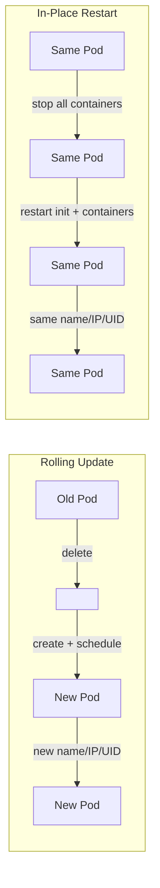
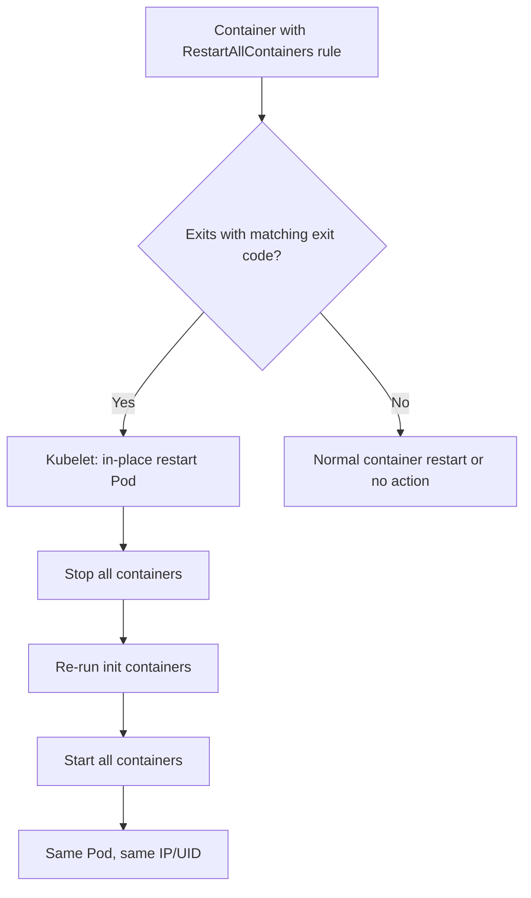
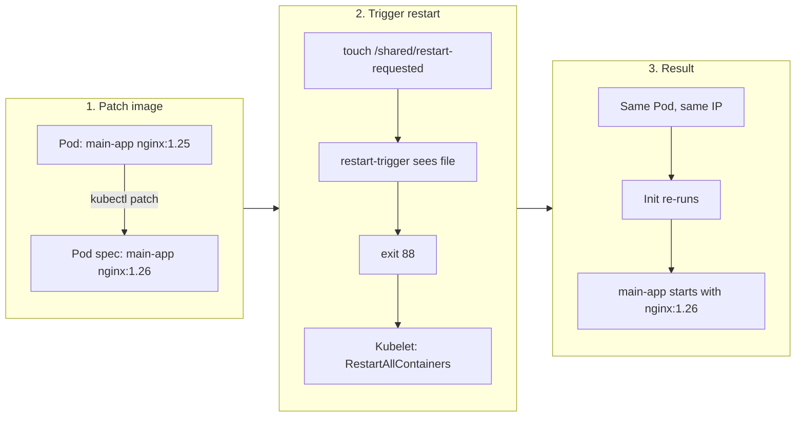
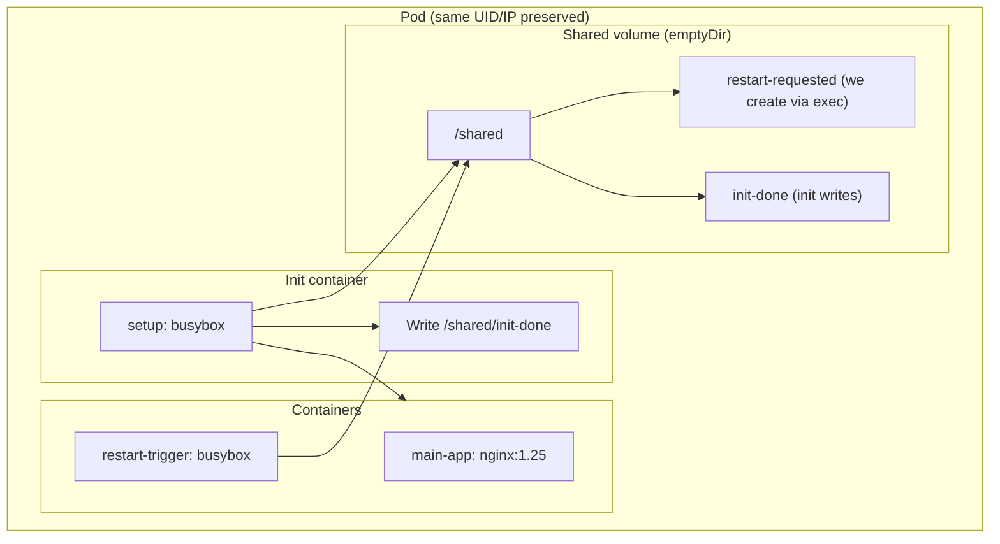

# In-Place Pod Restart Demo (Kubernetes 1.35+)

## Overview

When you only need to update a container image, a normal **Rolling Update** creates new Pods and deletes old ones, causing rescheduling and churn. Kubernetes 1.35 adds **Restart All Containers**: the kubelet can restart the **entire Pod in place** on the same node—keeping Pod UID, IP, and volumes—by re-running init containers and all containers. This demo shows how to use that feature to update an image **without rescheduling**: patch the image, trigger an in-place restart, and get the new image and a full init re-run on the same Pod.

---

## What Is In-Place Restart?

**In-place restart** means: the Pod is **not** deleted or recreated; the kubelet on the node stops all containers and then starts the Pod’s lifecycle again from scratch (init containers first, then all containers). Identity and resources of the Pod are preserved.



| | Rolling Update | In-Place Restart |
|---|----------------|------------------|
| Pod recreated? | Yes | No |
| Pod name / UID / IP | New | Unchanged |
| Rescheduling? | Yes | No |
| Volumes / network | New Pod, new mounts | Preserved |
| Init containers | Run once on new Pod | Re-run on each in-place restart |

**Kubernetes 1.35 behavior:**

- **Trigger:** A container that has `restartPolicyRules` with `action: RestartAllContainers` **exits** with an **exit code that matches** the rule (e.g. 88). Then the kubelet performs the in-place restart for that Pod.
- **Feature gates:** `RestartAllContainersOnContainerExits=true` and `NodeDeclaredFeatures=true` on both API server and kubelet (see `InPlaceRestartConfig.md`).
- **Observability:** Pod condition `AllContainersRestarting=True` during restart; container restart counts increase.

References: [Kubernetes v1.35: Restart All Containers](https://kubernetes.io/blog/2026/01/02/kubernetes-v1-35-restart-all-containers/), [KEP-5532](https://kep.k8s.io/5532).

---

## Trigger Condition (Only One)

There is **no** dedicated “restart all” API. In-place restart happens **only** when:

1. A container (init, sidecar, or main) has **`restartPolicyRules`** with **`action: RestartAllContainers`**.
2. That container **exits** (process terminates).
3. Its **exit code** matches the rule’s **`exitCodes`** (e.g. `operator: In`, `values: [88]`).



So to trigger from outside, we need a **sidecar** that we can cause to exit with that specific code (e.g. 88). This demo uses a file in a shared volume: when the file appears, the sidecar runs `exit 88`.

---

## How This Demo Uses It

Idea: **patch the image** → **trigger in-place restart** → Pod comes back with the new image and init re-run, **same name and IP**.



The **restart-trigger** sidecar:

- Has **`restartPolicyRules`**: when it exits with code **88**, action is **RestartAllContainers**.
- Runs a loop: if `/shared/restart-requested` exists, it removes the file and runs **`exit 88`**.

We trigger by creating that file from outside:

```bash
kubectl exec inplace-restart-demo -c restart-trigger -- touch /shared/restart-requested
```

---

## Files in This Directory

| File | Description |
|------|--------------|
| `inplace-restart-demo.yaml` | Example Pod YAML: init (busybox), main-app (nginx:1.25), restart-trigger sidecar (busybox + restartPolicyRules). |
| `InPlaceRestartConfig.md` | Prerequisites, enabling feature gates, troubleshooting. |
| `InPlaceRestartDemo.md` | Chinese version of this demo. |

---

## Prerequisites

1. **Kubernetes 1.35+** with feature gates enabled on **API server and kubelet**:
   - `RestartAllContainersOnContainerExits=true`
   - `NodeDeclaredFeatures=true` (required dependency)
2. Deploy the example Pod (or your own Pod with a similar restart-trigger sidecar).

See `InPlaceRestartConfig.md` for how to verify and enable these.

---

## Example Pod Structure

The demo Pod has three parts: one init container, two containers (main app + restart-trigger). The init and the restart-trigger share a volume so we can both trigger the restart and observe that init re-runs.



| Component | Image | Role |
|-----------|--------|------|
| **init: setup** | busybox:1.36 | Writes `/shared/init-done`; re-runs on every in-place restart. |
| **main-app** | nginx:1.25 → 1.26 (patched) | Main workload; image is updated via patch. |
| **restart-trigger** | busybox:1.36 | Polls `/shared/restart-requested`; on presence, runs `exit 88` to trigger RestartAllContainers. |

**Why init and restart-trigger share the same volume**

- **Trigger:** We `kubectl exec ... -c restart-trigger -- touch /shared/restart-requested`; the sidecar must see that path, so it needs a volume at `/shared`.
- **Observability:** Init writes `/shared/init-done`. Sharing the volume lets us `exec` into restart-trigger and `cat /shared/init-done` to confirm init re-ran after an in-place restart.

One shared volume covers both: trigger file and init marker.

---

## Demo Steps

Use the Pod name `inplace-restart-demo` (from the YAML). Replace it in commands if you use a different name.

### Deploy the Pod

```bash
kubectl apply -f /root/daisy/imageupdate_restartall/inplace-restart-demo.yaml
kubectl get pods -l app=inplace-restart-demo
# Wait until Running
```

### 1. Check current image and Pod state

```bash
kubectl get pods -l app=inplace-restart-demo -o jsonpath='{range .items[*]}{.metadata.name}{"\t"}{.status.podIP}{"\t"}{.spec.containers[0].image}{"\n"}{end}'
kubectl get pod inplace-restart-demo -o jsonpath='AllContainersRestarting: {.status.conditions[?(@.type=="AllContainersRestarting")].status}{"\n"}'
kubectl get pod inplace-restart-demo -o jsonpath='{range .status.containerStatuses[*]}{.name} restarts={.restartCount}{"\n"}{end}'
```

### 2. Update the image (patch)

```bash
kubectl patch pod inplace-restart-demo -p '{"spec":{"containers":[{"name":"main-app","image":"nginx:1.26"}]}}'
```

### 3. Trigger in-place restart

Create the trigger file inside the restart-trigger container; it will then exit with 88 and the kubelet will perform the in-place restart.

```bash
kubectl exec inplace-restart-demo -c restart-trigger -- touch /shared/restart-requested
```

### 4. Observe

Wait ~10–20 seconds, then:

```bash
kubectl get pods -l app=inplace-restart-demo -o wide
kubectl get pod inplace-restart-demo -o jsonpath='Pod IP: {.status.podIP}{"\n"}main-app image: {.spec.containers[0].image}{"\n"}{range .status.containerStatuses[*]}{.name} restarts={.restartCount}{"\n"}{end}'
```

**Expected:**

- Pod name and IP **unchanged** (no new Pod created).
- `AllContainersRestarting` is `True` during restart, then `False`.
- Container restart counts **increased**; `main-app` image is `nginx:1.26`; init runs again after each in-place restart.

### Example test result

| Check | Result |
|-------|--------|
| Deploy | Pod Running, e.g. IP 10.244.0.38 |
| Patch | main-app image updated to nginx:1.26 |
| Trigger | `touch /shared/restart-requested` → sidecar exits 88 → in-place restart |
| Observe | Same Pod name and IP; main-app on nginx:1.26; restart counts increased; AllContainersRestarting False |

---

## Comparison

**In-Place Restart vs single-container patch (InPlaceUpdate):**

| | InPlaceUpdate (patch image only) | This demo (patch + RestartAllContainers) |
|---|----------------------------------|------------------------------------------|
| Pod recreated? | No | No |
| Rescheduling? | No | No |
| Init re-run? | No | Yes |
| Use case | Image change only | Image change + full Pod reset (e.g. re-run init) |

**In-Place Restart vs Rolling Update:**

| | Rolling Update | In-Place Restart |
|--|----------------|------------------|
| Pod name / IP | New | Same |
| Rescheduling | Yes | No |
| Volumes / network | New Pod | Preserved |
| Typical time | Longer (schedule + pull + start) | Shorter (local restart + pull) |

---

## Notes

- **Alpha:** `RestartAllContainersOnContainerExits` is alpha; use in test environments only.
- **preStop:** Not run during in-place restart; containers must tolerate abrupt termination.
- **Controllers:** If a Deployment/StatefulSet owns the Pod, a manual `kubectl patch` may be overwritten on reconcile; production use should implement image update and trigger in the controller.
- **Sidecar:** restart-trigger should be reentrant and idempotent; expect init and sidecar to run multiple times.

---

## References

- [Kubernetes v1.35: Restart All Containers](https://kubernetes.io/blog/2026/01/02/kubernetes-v1-35-restart-all-containers/)
- [KEP-5532: Restart All Containers on Container Exits](https://kep.k8s.io/5532)
- [Pod Lifecycle – Container Restart Rules](https://kubernetes.io/docs/concepts/workloads/pods/pod-lifecycle/#container-restart-rules)
- This directory: `InPlaceRestartConfig.md` (prerequisites, feature gates, troubleshooting)
- This repo: `imageupdate_patch/InPlaceUpdate.md` (patch image only, single-container restart)
