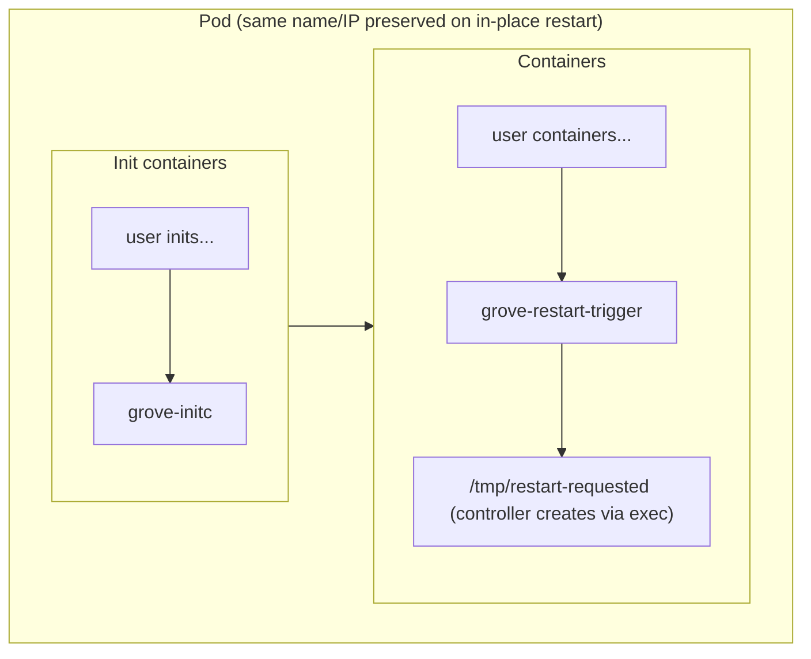

# Grove Integration with In-Place Restart (Operator-Native)

This document describes how **Grove** can natively use Kubernetes 1.35+ **In-Place Pod Restart** so that **when a user updates container images**, Grove **automatically** performs an in-place restart (no rescheduling, same Pod name and IP) while **continuing to honor `startsAfter`**. No extra work is required from the user beyond enabling the feature and updating the image in the PodCliqueSet template.

---

## 1. Why startsAfter Remains Valid with In-Place Restart

- **In-place restart semantics**: The kubelet does not delete the Pod; it restarts the Pod in place on the same node by terminating all containers and then **re-running all init containers in order**, then starting all main containers.
- **Grove’s grove-initc**: When `startsAfter` is set, Grove injects **grove-initc** as an **init container**. It waits until parent PodCliques reach minAvailable Ready before exiting, so main containers start only after dependencies are satisfied.
- **Conclusion**: After an in-place restart, **grove-initc runs again** as part of the init sequence and again waits for parent PodCliques before allowing main containers to start. So **startsAfter semantics are preserved** on every in-place restart with no extra logic.

```
Before in-place restart:  [init: grove-initc] → [main containers...]
After in-place restart:   [init: grove-initc] runs again, waits for parents → [main containers...] start
```

---

## 2. Integration Goal and Constraints

- **Goal**: When the user updates container image(s) (e.g. in the PodCliqueSet template), Grove **automatically** updates the Pod’s images and triggers an in-place restart so that:
  - The Pod keeps the same name, UID, and IP (no rescheduling).
  - Init containers (including grove-initc) run again, so **startsAfter** remains enforced.
  - No manual `kubectl exec` or patch is required from the user.
- **Constraints**:
  - Cluster must be Kubernetes **1.35+** with **RestartAllContainersOnContainerExits** and **NodeDeclaredFeatures** enabled (see `InPlaceRestartConfig.md`).
  - In-place restart is triggered when a container with **restartPolicyRules** (e.g. `action: RestartAllContainers`, exit code 88) **exits with that code**. So Grove must inject a **restart-trigger sidecar** that can be signaled to exit 88 (e.g. by creating a file such as `/tmp/restart-requested` that the sidecar watches).

---

## 3. Operator-Native Design (Single Approach)

Grove implements in-place restart **inside the operator**: it injects the restart-trigger sidecar when building Pods, and when it detects an **image update**, it **patches the Pod’s container image(s)** and then **triggers the restart** (e.g. by creating `/tmp/restart-requested` in the sidecar via exec). The user only enables the feature and updates the template; Grove does the rest.

### 3.1 Configuration

Add an optional switch so that in-place restart is used for image updates instead of recreating Pods:

- **PodCliqueSet** or **PodCliqueTemplateSpec**: e.g. `inPlaceRestart: { enable: true }` (per clique or for all cliques in the template).

When `enable: true`, Grove injects the restart-trigger infrastructure and uses in-place restart on image-only updates.

### 3.2 What Grove Injects When Building a Pod

After applying the user’s `podSpec` and, when applicable, **grove-initc** (for `startsAfter`), and **before** returning from Pod construction:

1. **Container**: Append a **grove-restart-trigger** container:
   - **Image**: From operator config (e.g. env `GROVE_RESTART_TRIGGER_IMAGE`), default e.g. busybox.
   - **Command**: Loop that watches for a trigger file at `/tmp/restart-requested`; when present, remove it and **exit 88**. No extra volume is needed (uses the container's writable `/tmp`).
   - **restartPolicy** / **restartPolicyRules**: `action: RestartAllContainers`, `exitCodes: [88]` (or equivalent for the cluster’s API version).

Resulting Pod order:

- **InitContainers**: `[user inits..., grove-initc]` (grove-initc only when `startsAfter` is set).
- **Containers**: `[user containers..., grove-restart-trigger]`.

On in-place restart, all inits (including grove-initc) run again, so **startsAfter** is preserved.

**Pod structure (when in-place restart and optionally startsAfter are enabled):**



### 3.3 Automatic Image Update and In-Place Restart Flow

When the controller reconciles a PodClique and finds that the **desired Pod spec** (from the PodCliqueSet template) differs from the **current Pod** only (or primarily) by **container image(s)**:

1. **Patch the Pod**: Update the Pod’s `spec.containers[].image` (and, if needed, `spec.initContainers[].image`) to match the new template. Do **not** replace the whole spec so that the Pod object (name, UID, ownerRef, etc.) stays the same.
2. **Trigger in-place restart**: Cause the **grove-restart-trigger** container to exit with code 88 so that the kubelet performs Restart All Containers. For example:
   - **Exec**: From the controller, `kubectl exec <pod> -c grove-restart-trigger -- touch /tmp/restart-requested` (or the same via the Kubernetes client exec API). The sidecar sees the file and exits 88.
   - Alternatively, the trigger container could expose a small HTTP endpoint or watch a well-known annotation; the file-based approach is simple and does not require an extra volume or RBAC.

After the trigger, the kubelet restarts the Pod in place: all inits (including grove-initc) run again, then all containers start with the **new image(s)**. **startsAfter** is re-enforced by grove-initc.

**End-to-end flow:**

```mermaid
flowchart LR
  subgraph User["User"]
    U1[Update image in PodCliqueSet template]
  end

  subgraph Grove["Grove controller"]
    G1[Reconcile PodClique]
    G2{Image-only diff & inPlaceRestart enabled?}
    G3[Patch Pod spec.containers[].image]
    G4[Exec: touch /tmp/restart-requested]
    G1 --> G2
    G2 -->|Yes| G3 --> G4
  end

  subgraph Kubelet["Kubelet"]
    K1[grove-restart-trigger exits 88]
    K2[Restart All Containers]
    K3[Re-run inits incl. grove-initc]
    K4[Start containers with new image]
    K1 --> K2 --> K3 --> K4
  end

  U1 --> G1
  G4 --> K1
  K4 --> Same[Same Pod name / IP; startsAfter preserved]
```

### 3.4 When to Use In-Place Restart vs. Recreate

- **In-place restart**: Use when the **only** (or dominant) change is **container image(s)** and the feature is enabled for that clique. Patch image and trigger restart; keep the same Pod.
- **Recreate Pod**: Use when the template change includes non-in-place changes (e.g. new volume, new container, change to init containers, or other structural changes). In that case, Grove continues to replace the Pod as it does today.

Defining “image-only” precisely (e.g. ignoring resource-only or env-only changes) is an implementation detail the operator can tune.

### 3.5 Code Locations (Suggestions)

- **Pod build**: In `operator/internal/controller/podclique/components/pod/pod.go`, after `configurePodInitContainer` (and any other existing injections), call a new helper, e.g. `configureInPlaceRestartTrigger(pcs, pclq, pod)`, when `inPlaceRestart.enable` is true for that clique.
- **New module**: e.g. `operator/internal/controller/podclique/components/pod/inplace_restart.go`:
  - `configureInPlaceRestartTrigger(pcs, pclq, pod)`: Appends the **grove-restart-trigger** container (image, command watching `/tmp/restart-requested`, restartPolicyRules) to `pod.Spec`. No extra volume is required.
- **Reconcile / image update**: In the PodClique sync logic that compares desired vs current Pod:
  - If the only significant diff is container (and/or init container) images and in-place restart is enabled: patch the Pod’s image(s), then trigger the restart (e.g. exec `touch /tmp/restart-requested` in the trigger container).
  - Otherwise, keep existing create/delete/replace behavior as needed.

### 3.6 Trigger Container Image and Versioning

- **Image**: Configurable (e.g. `GROVE_RESTART_TRIGGER_IMAGE`); default to a small, well-known image (e.g. busybox) so that no private registry is required.
- **Versioning**: Optionally tag the image with the Grove version for consistency; otherwise use a fixed tag for stability.

---

## 4. User Experience Summary

| What the user does | What Grove does |
|--------------------|------------------|
| Sets `inPlaceRestart: { enable: true }` on the PodCliqueSet (or per clique) | Injects the **grove-restart-trigger** container into every Pod of that clique (trigger file: `/tmp/restart-requested`). |
| Updates container image(s) in the PodCliqueSet template (e.g. from `app:v1` to `app:v2`) | On reconcile: patches the Pod’s container image(s) to the new value, then triggers in-place restart (e.g. exec touch). Pod name and IP stay the same; grove-initc runs again so **startsAfter** is preserved. |
| No manual exec or patch | All steps are performed by the Grove controller. |

---

## 5. Preserving startsAfter

- **startsAfter** is enforced by **grove-initc**, which runs as an init container before main containers.
- On every **in-place restart**, the kubelet re-runs **all** init containers (including grove-initc), then starts all containers. So after an image-update-triggered in-place restart, grove-initc runs again and again waits for parent PodCliques to be Ready before allowing main containers to start.
- No change to startsAfter semantics or to the existing grove-initc implementation is required.

---

## 6. Prerequisites and Notes

- **Feature gates**: Cluster must have **RestartAllContainersOnContainerExits** and **NodeDeclaredFeatures** enabled (see `InPlaceRestartConfig.md`).
- **CRD / API**: The Container type used in the Pod spec (and in the CRD if Grove uses a generated schema) must support **restartPolicyRules** and the **RestartAllContainers** action (Kubernetes 1.35+ beta). Grove may need to update its CRD or dependency versions to include these fields.
- **preStop**: In-place restart does **not** run preStop hooks; applications should tolerate abrupt termination or implement cleanup elsewhere if needed.
- **Observability**: Pod condition **AllContainersRestarting** and container **restart counts** can be used to observe in-place restarts.

---

## 7. References

- [Kubernetes v1.35: Restart All Containers](https://kubernetes.io/blog/2026/01/02/kubernetes-v1-35-restart-all-containers/)
- [KEP-5532: Restart All Containers on Container Exits](https://kep.k8s.io/5532)
- [Pod Lifecycle – Container Restart Rules](https://kubernetes.io/docs/concepts/workloads/pods/pod-lifecycle/#container-restart-rules)
- This directory: `InPlaceRestartConfig.md` (prerequisites, feature gates)
- This directory: `InPlaceRestartDemo_EN.md` (standalone Kubernetes in-place restart demo)
